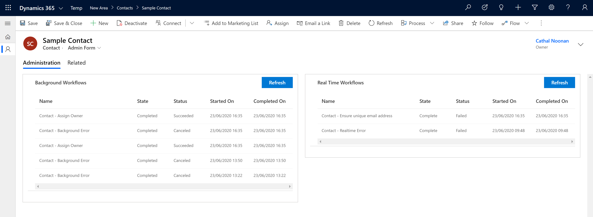

# D365 PCF - Process Sessions

Custom Control to show the Process Sessions related to the current record on the unified interface

Double clicking on a record in the grid will open the details of that process session

---

## Downloads

Download a managed solution from the [releases page](https://github.com/cathalnoonan/d365-pcf-processsessions/releases)

---

## Docs
- [Configuration](docs/configuration.md)
- [Migration from V1 to V2](docs/migration-v1-v2.md)
- [Building](docs/building.md)

---

## LICENSE: MIT
